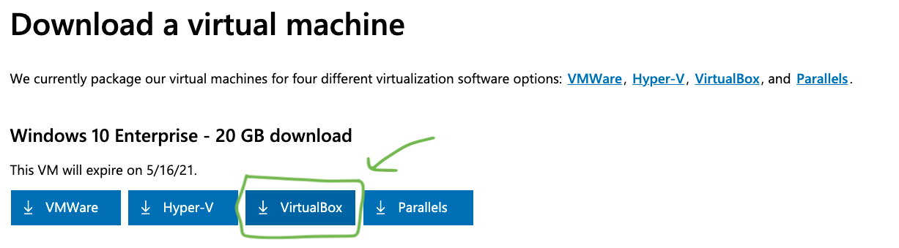
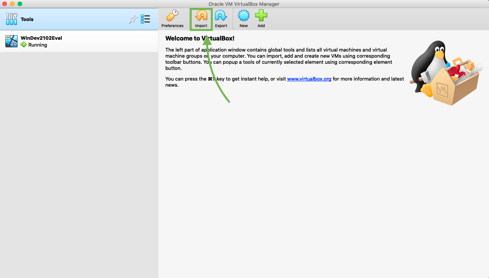
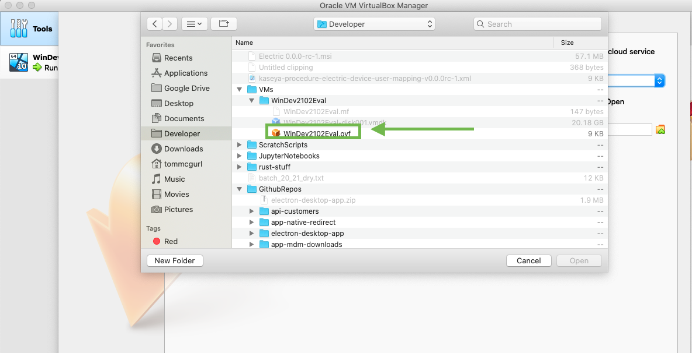
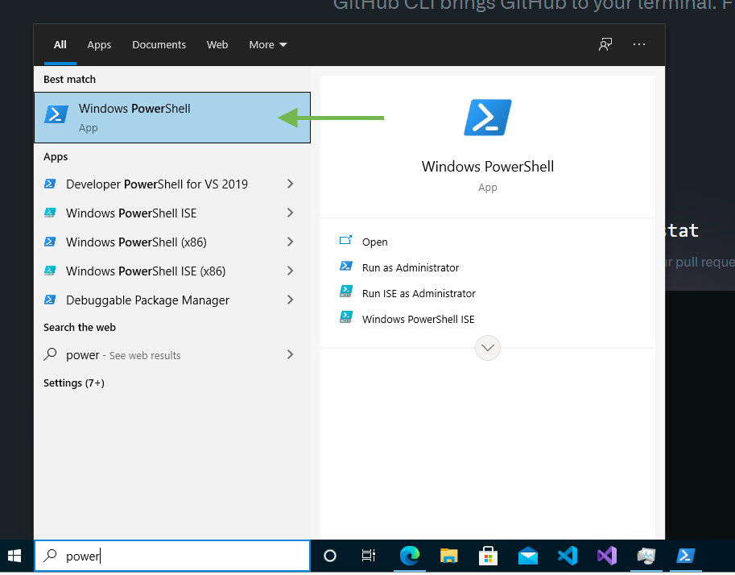

# Electric Device User Mapping Desktop Application

> Electron Desktop application used to send a device assignment request to Electric

> Vite+Electron = 🔥

---

## Getting Started

# install dependencies

First you will want to make sure you are on the latest node version.

My recommendation is to use the `n` library for managing node dependencies (it's better than nvm)

To install `n` simply run

```bash
sudo npm install -g n
```

Once you have `n` installed you can install the latest node version by running

```bash
sudo n install node@latest
```

> The version as of writing this is `16.13.0`

To switch between node versions using `n` simply run

```bash
sudo n
```

You will be prompted with a UI where you can select which version to run

Next install your dependencies using.

```bash
npm install
```

### Development Scripts

```bash
# run application in development mode
npm run watch

# compile source code and create webpack output
npm run compile

# `npm run compile` & create unpacked build with electron-builder for Windows
npm run dist:windows

# `npm run compile` & create unpacked build with electron-builder for macOS
npm run dist:mac

```

---

## Features of the Template

This project was templated from the vite-electron-builder-template for electron applications. Written following the latest safety requirements, recommendations and best practices.

Under the hood is used [Vite] — super fast, nextgen bundler, and [electron-builder] for compilation.

---

### Electron [][electron]

- Template use the latest electron version with all the latest security patches.
- The architecture of the application is built according to the security [guides](https://www.electronjs.org/docs/tutorial/security) and best practices.
- The latest version of the [electron-builder] is used to compile the application.

### Vite [][vite]

- [Vite] is used to bundle all source codes. This is an extremely fast packer that has a bunch of great features. You can learn more about how it is arranged in [this](https://youtu.be/xXrhg26VCSc) video.
- Vite [supports](https://vitejs.dev/guide/env-and-mode.html) reading `.env` files. You can also specify types of your environment variables in [`types/vite-env.d.ts`](types/vite-env.d.ts).
- Hot reloads for `Main` and `Renderer` processes.

Vite provides you with many useful features, such as: `TypeScript`, `TSX/JSX`, `CSS/JSON Importing`, `CSS Modules`, `Web Assembly` and much more.

[See all Vite features](https://vitejs.dev/guide/features.html).

### TypeScript [][typescript]

- The Latest TypeScript is used for all source code.
- **Vite** supports TypeScript out of the box. However, it does not support type checking.
- Code formatting rules follow the latest TypeScript recommendations and best practices thanks to [@typescript-eslint/eslint-plugin](https://www.npmjs.com/package/@typescript-eslint/eslint-plugin).

### Continuous Integration

- The configured workflow for check the types for each push and PR.
- The configured workflow for check the code style for each push and PR.

### Continuous delivery

- Each time you push changes to the `main` branch, [`release`](.github/workflows/release.yml) workflow starts, which creates release draft.
  - The version is automatically set based on the current date in the format `yy.mm.dd-minutes`.
  - Notes are automatically generated and added to the release draft.
  - Code signing supported. See [`compile` job in `release` workflow](.github/workflows/release.yml).
- **Auto-update is supported**. After the release will be published, all client applications will download the new version and install updates silently.

## Status

This template was created to make my work easier. It may not be universal, but I try to keep it that way.

I am actively involved in its development. But I do not guarantee that this template will be maintained in the future.

**At the moment, there are the following problems:**

- ⚠ Release notes are created automatically based on commit history. [`.github/actions/release-notes`](.github/actions/release-notes) is used for generation. It may not provide some scenarios. If you encounter a problem - write about it.
- ⏳ I want to migrate all code base to ESM. But because Nodejs ecosystem is unprepared I have not known whether this will give more benefits or more inconvenience.

Some improvement or problems can be listed in [issues](https://github.com/cawa-93/vite-electron-builder/issues).

**Pull requests are welcome**.

## How it works

The template required a minimum [dependencies](package.json). Only **Vite** is used for building, nothing more.

### Project Structure

The structure of this template is very similar to the structure of a monorepo.

The entire source code of the program is divided into three modules (packages) that are bundled each independently:

- [`packages/main`](packages/main)
  Electron [**main script**](https://www.electronjs.org/docs/tutorial/quick-start#create-the-main-script-file).
- [`packages/preload`](packages/preload)
  Used in `BrowserWindow.webPreferences.preload`. See [Checklist: Security Recommendations](https://www.electronjs.org/docs/tutorial/security#2-do-not-enable-nodejs-integration-for-remote-content).
- [`packages/renderer`](packages/renderer)
  Electron [**web page**](https://www.electronjs.org/docs/tutorial/quick-start#create-a-web-page).

### Build web resources

Packages `main` and `preload` are built in [library mode](https://vitejs.dev/guide/build.html#library-mode) as it is a simple javascript.
`renderer` package build as regular web app.

The build of web resources is performed in the [`scripts/build.js`](scripts/build.js). Its analogue is a sequential call to `vite build` for each package.

### Compile App

Next step is run packaging and compilation a ready for distribution Electron app for macOS, Windows and Linux with "auto update" support out of the box.

To do this, using the [electron-builder]:

- In npm script `compile`: This script is configured to compile the application as quickly as possible. It is not ready for distribution, is compiled only for the current platform and is used for debugging.
- In GitHub Action: The application is compiled for any platform and ready-to-distribute files are automatically added to the draft GitHub release.

### Using Node.js API in renderer

According to [Electron's security guidelines](https://www.electronjs.org/docs/tutorial/security#2-do-not-enable-nodejs-integration-for-remote-content), Node.js integration is disabled for remote content. This means that **you cannot call any Node.js api in the `packages/renderer` directly**. To do this, you **must** describe the interface in the `packages/preload` where Node.js api is allowed:

```ts
// packages/preload/src/index.ts
import { readFile } from 'fs/promises';

const api = {
  readConfig: () => readFile('/path/to/config.json', { encoding: 'utf-8' }),
};

contextBridge.exposeInMainWorld('electron', api);
```

```ts
// packages/renderer/src/App.vue
import { useElectron } from '/@/use/electron';

const { readConfig } = useElectron();
```

[Read more about Security Considerations](https://www.electronjs.org/docs/tutorial/context-isolation#security-considerations).

### Modes and Environment Variables

All environment variables set as part of the `import.meta`, so you can access them as follows: `import.meta.env`.

You can also specify types of your environment variables in [`types/vite-env.d.ts`](types/vite-env.d.ts).

The mode option is used to specify the value of `import.meta.env.MODE` and the corresponding environment variables files that needs to be loaded.

By default, there are two modes:

- `production` is used by default
- `development` is used by `npm run watch` script

When running building, environment variables are loaded from the following files in your project root:

```
.env                # loaded in all cases
.env.local          # loaded in all cases, ignored by git
.env.[mode]         # only loaded in specified env mode
.env.[mode].local   # only loaded in specified env mode, ignored by git
```

**Note:** only variables prefixed with `VITE_` are exposed to your code (e.g. `VITE_SOME_KEY=123`) and `SOME_KEY=123` will not. You can access `VITE_SOME_KEY` using `import.meta.env.VITE_SOME_KEY`. This is because the `.env` files may be used by some users for server-side or build scripts and may contain sensitive information that should not be exposed in code shipped to browsers.

---

# Building the Windows MSI

Unfortunately, the Windows MSI can only be built from a Windows device. To get around this on other Operating systems we can use a Windows 10 Virtual Machine.

## Setting Up a Windows 10 Virtual Machine (VM) for Building the MSI

1. First you will need to download [Virtual Box](https://www.virtualbox.org/wiki/Downloads) on your host Operating System (OS). Just pick the correct one for you OS. If installation fails, move the VirtualBox to trash. Try installing with homebrew. `brew install --cask virtualbox`, then go to `System Preferences` -> `Security & Privacy` and allow Oracle to make changes. Run brew install again.

2. Next you will need to download a [Windows 10 VM](https://developer.microsoft.com/en-us/windows/downloads/virtual-machines/). Select the one for **virtual Box**.
   

3. Open **Virtual Box** and select import
   

4. Navigate to where you downloaded the Windows 10 vm and select the **.ovf** file
   

5. Complete the import **using the default options**. This will take a few minutes so hang in there.

> NOTE: The VM uses a good amount of Hard Drive (HD) space. If you run into an error during the import process it is likely due to not having enough free HD space on the host machine. Clean up some space (delete all those old downloads and pirated movies 😜) and try again.

6. Once the import is complete you can start you new VM.

---

> The rest of the steps should be **done from the Windows VM not the host OS**

7. Now we will pull down the codebase from github. To make this easier (without dealing with ssh key generation) we will use the github cli. You can [download the Github CLI here](https://cli.github.com/).

8. Next you will need to open up a **Powershell Terminal**. To find it, just click the search bar in the Windows dock and type Powershell. (Powershell, unlike the default terminal, is a bash shell so the commands will be familiar to LinuxOS and macOS users).
   

9. Create a folder for holding the codebase. I use a folder called `Developer` so if you want to do the same simply run `mkdir Developer` then `cd Developer/`

10. To clone the codebase we first need to login via the Github cli. To do that simply run
    `gh auth login` and follow the instruction on the terminal to complete login.

11. Next you can clone the codebase by running `gh repo clone ElectricAI/electron-desktop-app`

    > NOTE: you may have to restart powershell to get it to recognize the `gh` command

12. Next we will need to download and install (NodeJS for window)[https://nodejs.org/en/download/]

13. Once downloaded, `cd` into the repo and run `npm i` to install the necessary dependencies

    > NOTE: you may have to restart powershell to get it to recognize the `npm` command after you've installed NodeJS

14. To build the project for windows you can run `npm run dist:windows`. This will place an `.msi` file in the `/dist` directory with a package version reflecting the version from the `package.json`. It will also generate some Kaseya procedure `.xml` files for uninstallation and installation. We will talk about how to use those in the next section.

## Uploading a new build to Kaseya

> 🚧 Work in Progress 🚧
